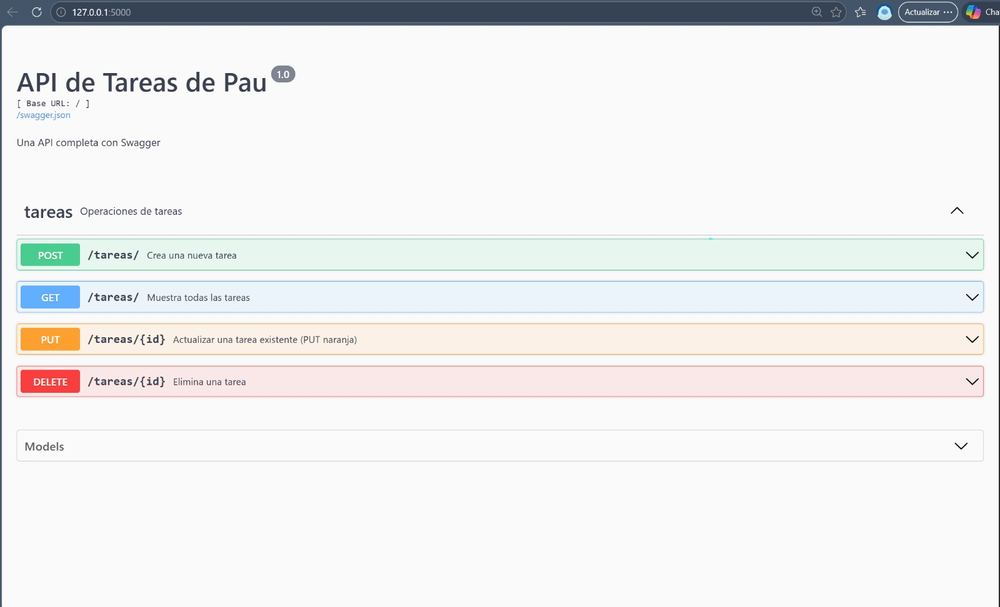

# Proyecto-Api

# 📝 API REST de Gestión de Tareas (Ejercicio 3.8)

Este proyecto es una **API REST** desarrollada con **Python** y **Flask-RESTX**. Permite gestionar tareas personales (CRUD completo) y cuenta con una interfaz visual interactiva generada con **Swagger UI**.

## 🚀 Funcionalidades
La API permite realizar las siguientes acciones siguiendo el estándar REST:

* **POST** `/tareas/`: Registrar una nueva tarea (**Verde**).
* **GET** `/tareas/`: Listar todas las tareas registradas (**Azul**).
* **PUT** `/tareas/{id}`: Actualizar el título, descripción o estado de una tarea (**Naranja**).
* **DELETE** `/tareas/{id}`: Eliminar una tarea de la lista mediante su ID (**Rojo**).

## 🛠️ Tecnologías Utilizadas
* **Lenguaje:** [Python 3.10+](https://www.python.org/)
* **Framework:** [Flask](https://flask.palletsprojects.com/)
* **Documentación:** [Flask-RESTX](https://flask-restx.readthedocs.io/) (Swagger UI)

## 📦 Instalación y Uso

## Instalar dependencias:

## Bash
pip install flask flask-restx
Correr la aplicación:

## Bash
python app.py

## Probar la API:
Abre tu navegador en http://127.0.0.1:5000/ para acceder a la consola de Swagger.

## Evidencia 

